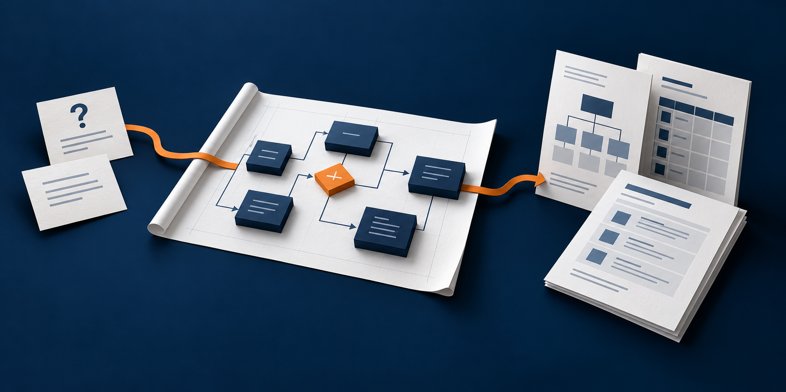

# Клиентские проекты ИИ-агентов



[](https://github.com/eiler2005/client-ai-agents/actions/workflows/checks.yml)
[](pyproject.toml)

**От задачи клиента — к обоснованному решению и материалам проекта.**

`client-ai-agents` — методика, шаблоны и инструменты Синимекс для подготовки
клиентских ИИ-проектов: понять задачу, определить границы решения, спланировать
пилот, оценить готовность и подготовить предложение.

Команда собирает основания и принимает решения. Инструменты проверяют данные,
рассчитывают оценку по рубрике и собирают Markdown, PDF и редактируемый PowerPoint.
Общая база хранится в Git; материалы клиентов — в отдельных локальных папках.

[Быстрый старт](#быстрый-старт) · [Документация](docs/README.md) ·
[Библиотека материалов](docs/CONSULTING_ARTIFACTS.md) · [Изменения](CHANGELOG.md)

## С какой задачей вы пришли

| Задача | Результат работы | Откуда начать |
|---|---|---|
| Подготовиться к первой встрече | Понимание задачи, сценарии, границы и вопросы к согласованию | [Структура клиентской презентации](docs/PRESENTATION_STRUCTURE.md) |
| Обосновать подход | Концепция решения, периметр пилота, метрики и критерии приёмки | [Процесс подготовки материалов](docs/CONSULTING_ARTIFACTS.md) |
| Оценить готовность проекта | Уровни по рубрике, охват, блокеры и план действий | [Методика оценки](docs/METHODOLOGY.md) |
| Подготовить предложение | Объём, этапы, команда, условия и подтверждённый опыт Синимекс | [Правила коммерческого предложения](docs/PROPOSAL.md) |

База предназначена для руководителей клиентских проектов, бизнес-аналитиков,
архитекторов и специалистов по ИИ. Концепцию, ТЗ и материал первой встречи
команда готовит по скиллу и библиотеке; оценка и КП имеют отдельные YAML-схемы
и автоматическую сборку.

## Быстрый старт

Нужны Python 3.12+ и [uv](https://docs.astral.sh/uv/). Начните с вымышленных
примеров: клиентские данные для знакомства с инструментом не требуются.
Для клонирования нужен доступ к закрытому репозиторию.

```sh
git clone https://github.com/eiler2005/client-ai-agents.git
cd client-ai-agents
uv sync --group dev --group pdf
git config core.hooksPath .githooks

uv run assess --demo check
uv run assess --demo score
uv run assess --demo build
```

`check` проверяет рубрику, профиль компании и примеры. `score` показывает балл,
охват и решение. `build` собирает страницы и фигуры в `docs/`.

**Получить PDF-отчёт и предложение:**

```sh
uv run assess --demo pdf --out dist/pdf-demo
uv run assess --demo proposal --out dist/kp-demo
```

Для PDF с диаграммами нужен `rsvg-convert` из librsvg и кириллические шрифты.
В CI используются `fonts-dejavu-core` и `librsvg2-bin`; на macOS librsvg
устанавливается через `brew install librsvg`.
Результаты и манифесты лежат в `dist/` и остаются локально.

**Получить редактируемый PowerPoint:**

```sh
uv run assess --demo slides --only demo-retail-support
uv run assess --demo slides --kind proposal --only demo-retail-support-kp
```

PPTX требует Node.js 22+ и доступного `@oai/artifact-tool` из среды Codex.
`uv sync` этот пакет не устанавливает. Подключение описано в
[стандарте презентаций](docs/PRESENTATION.md).
`assess slides` использует базовый автоматический макет; для развёрнутой
клиентской презентации в стиле Cinimex Consulting есть
[отдельный конвейер](templates/presentations/cinimex-consulting/README.md).

## Как устроена работа

Каждый шаг заканчивается материалом для обсуждения и проверки.

| Шаг | Что фиксируем | Результат |
|---|---|---|
| Понять задачу | Пользователи, процесс, сценарии, ограничения и неизвестное | Постановка задачи и вопросы к согласованию |
| Предложить решение | Данные, инструменты, роль модели, интеграции и участие человека | Концепция и схема решения |
| Спланировать пилот | Периметр, метрики, примеры обращений и критерии приёмки | План проверки качества и ценности |
| Оценить готовность | Подтверждения, уровни по рубрике, блокеры и действия | Отчёт об оценке |
| Подготовить предложение | Объём, этапы, роли, условия и релевантный опыт | КП и следующие решения |

В материале первой встречи явно разделяются **понимание задачи клиента**
и **предлагаемый подход**. В начале — содержание и резюме для руководства;
далее — сценарии, решение, методика Синимекс, пилот, ценность и приёмка.
Объём определяется задачей; структура рассчитана на самостоятельное чтение.

Подготовка материалов помогает спланировать внедрение. Сам агент, его интеграции
и эксплуатация реализуются в соответствующем клиентском проекте.

## Одна база — несколько материалов

| Материал | Источник | Как подготовить |
|---|---|---|
| Концепция, ТЗ, материал первой встречи | Подтверждённые вводные и открытые вопросы клиента | [Скилл и библиотека](skills/consulting-presentations/SKILL.md), [структура рассказа](docs/PRESENTATION_STRUCTURE.md) |
| Отчёт об оценке в Markdown / PDF | YAML оценки и общая рубрика | `assess build` / `assess pdf` |
| Коммерческое предложение в Markdown / PDF | YAML предложения и профиль Синимекс; при необходимости — оценка | `assess build` / `assess proposal` |
| Презентация оценки или КП | Те же YAML и визуальный стандарт | `assess slides` |
| Презентация для чтения с предметными схемами | Локальный исходник и профиль компании | [Reading-конвейер Cinimex Consulting](docs/PRESENTATION.md) |

Команды запускаются через `uv run`. Перед сборкой полезно выполнить
`uv run assess check`; `uv run assess --help` показывает все команды.

## Основания остаются рядом с выводами

**Оценка показывает и зрелость, и полноту обследования.** Рубрика содержит
12 измерений в четырёх группах со шкалой 0–4. В балл входят только оценённые
измерения; неизвестное снижает охват. Данные и знания, безопасность и оценка
качества — блокирующие измерения: уровень 0–1 ограничивает решение даже
при высокой средней оценке. Правила и пороги — в
[рубрике](src/content/rubric.yaml) и [методике](docs/METHODOLOGY.md).

**Утверждения о Синимекс имеют источник и дату.** Факты, услуги и кейсы берутся
из [профиля компании](src/content/company.yaml). КП ссылается на записи по ID;
неизвестная ссылка не проходит проверку. Результаты других проектов приводятся
с оговоркой, а ожидаемый эффект пилота остаётся гипотезой до измерения.

**Черновик и готовый материал проверяются по разным требованиям.** Черновик
`draft` допускает незаполненные измерения. Для финальной оценки `final` обязательны
уровни, подтверждения и предусмотренные методикой рекомендации. Автоматические проверки
дополняются чтением извлечённого текста, просмотром каждой страницы или слайда
и проверкой манифеста. Решение о передаче заказчику принимает команда.

## Библиотека для презентаций, документов и PDF

[Consulting Presentations](skills/consulting-presentations/SKILL.md) помогает
выбрать содержательный и визуальный шаблон до написания и оформления.
Четыре слоя выбираются независимо:

| Слой | Что определяет | Где смотреть |
|---|---|---|
| Управленческий шаблон | Вопрос адресата, основания, решение и ответственная роль | [10 шаблонов](skills/consulting-presentations/references/management-templates.md) |
| Визуальная композиция | Сравнение, процесс, зависимости, покрытие или структуру | [15 композиций](skills/consulting-presentations/references/visual-patterns.md) |
| Геометрия формата | Размеры, поля и компоновку A4 / 16:9 | [Профили форматов](skills/consulting-presentations/assets/format-profiles.json) |
| Стиль | Цвета, шрифты и бренд | [Нейтральный и Cinimex](skills/consulting-presentations/assets/styles/) |

База пополняется абстрактными приёмами из примеров и исследований. Большинство
записей — рецепты; наличие готового примера и проверенные форматы указаны
отдельно в [каталоге](skills/consulting-presentations/library/catalog.json).
Цвета и бренд меняются без переписывания логики шаблона.

```sh
python3 skills/consulting-presentations/scripts/library.py search "статус"
python3 skills/consulting-presentations/scripts/library.py search "диагностика" --kind visual
python3 skills/consulting-presentations/scripts/library.py check
```

Нативные схемы и таблицы сохраняются редактируемыми. Вставленные изображения
проверяются с учётом фактического размера на слайде и обрезки; схема с мелкими
подписями требует переработки. [Процесс и проверки](docs/CONSULTING_ARTIFACTS.md)
описаны отдельно от [стиля Cinimex Consulting](templates/presentations/cinimex-consulting/README.md).

## Свой клиентский проект

Создайте отдельную локальную папку по
[структуре клиентского проекта](clients/README.md). CLI принимает её каталоги
явно; замените `client-id` и `project-id` на локальные идентификаторы.

```sh
uv run assess --input clients/client-id/assessments \
  --proposals clients/client-id/proposals new project-id

uv run assess --input clients/client-id/assessments \
  --proposals clients/client-id/proposals new project-id-kp --kind proposal

uv run assess --input clients/client-id/assessments \
  --proposals clients/client-id/proposals check

uv run assess --input clients/client-id/assessments \
  --proposals clients/client-id/proposals \
  --docs dist/clients/client-id/docs build
```

Заполните YAML и повторяйте `check` по мере работы. Файлы оценки и предложения
связываются через `project.assessment`; связанные документы используют одно
понимание готовности и пробелов. [Вымышленные примеры](examples/)
показывают заполнение этой связки.

## Что хранится в Git

| Общая база в репозитории | Локальные материалы вне Git |
|---|---|
| Код, рубрика, профиль компании, документация, скилл и шаблоны | Запросы и исходники клиентов, ТЗ, оценки и коммерческие условия |
| Полностью вымышленные примеры | Клиентские презентации, PDF, превью и манифесты |
| Абстрактные визуальные рецепты и оригинальная обложка README | Пользовательские исходные презентации и их полный разбор |

`clients/<client-id>/`, `assessments/`, `proposals/`, `dist/` и исходные
референсы исключены из Git. Хуки проверяют индекс и новую историю перед push;
удаление клиентского файла поздним коммитом не очищает раннюю историю.
Для оригинальной обложки README разрешён единственный PNG с проверяемым
хешем; это исключение не распространяется на клиентские изображения.
В клиентских материалах указываются роли, а не имена сотрудников заказчика.
Подробности — в [правилах проекта](AGENTS.md) и
[правилах хранения референсов](reference-materials/README.md).

## Разработка

Перед передачей результата:

```sh
uv run ruff check .
uv run ruff format --check .
uv run pytest -q
uv run assess --demo check
uv run assess --demo build
```

[GitHub Actions](.github/workflows/checks.yml) проверяет код, примеры, сборку
PDF/КП и соблюдение правил хранения клиентских данных. PPTX требует отдельной сборки и
визуального просмотра. Добавляйте в индекс явные пути; хуки не обходятся.

[Карта документации](docs/README.md) · [Исходные шаблоны](templates/) ·
[Вымышленные примеры](examples/) · [Правила для агентов](AGENTS.md) ·
[Условия использования](LICENSE)

Внутренний инструмент Синимекс. Краткое описание для каталога проектов:
**методика и инструменты подготовки клиентских ИИ-проектов — от понимания задачи
и концепции решения до плана пилота, оценки, презентации и коммерческого предложения.**
